# Smita Prajapati

**Software Engineer · GSoC · NIT Raipur Silver Medalist**

---

Software Engineer specializing in **Test Automation** and **Microservices Architecture** in the Investment Banking domain. Built regression suites from scratch, reducing manual testing efforts by **80%**. Developed backend microservices and secure data ingestion using REST APIs. Google Summer of Code contributor to Checkstyle, 255 merged PRs, 94% test suppression reduction, client-side search across 300+ documentation pages. Interested in quality infrastructure, distributed systems, and open-source tooling.

---

#### Google Summer of Code · Checkstyle

<table width="100%">
<tr>
<td align="center"><strong>255</strong> Pull Requests Merged</td>
<td align="center"><strong>94%</strong> Suppression Reduction (228 → 10)</td>
<td align="center"><strong>2,500+</strong> Search Entries Indexed</td>
<td align="center"><strong>300+</strong> Pages with TOC</td>
<td align="center"><strong>~8,000</strong> Lines of Code</td>
</tr>
</table>

## GitHub Stats
 

  
  &nbsp;&nbsp;

  

---

## Technical Stack

### Languages

### Backend & Architecture

### Documentation & Site Infrastructure

### Testing & Automation

### CI/CD & DevOps

### Cloud & AI

---

## Recognition

| Award | Where | Year |
|---|---|---|
| RCP Excellence Award | Deutsche Bank | 2025 |
| Silver Medalist — 9.53 CGPA| NIT Raipur | 2024 |
| IAS Research Fellow  | IISc Bangalore | 2022 |
| Campus Star 6.0 — Brightest Engineering Minds | The Economic Times | 2023 |

---

> *"Quality isn't tested in — it's engineered in."*
